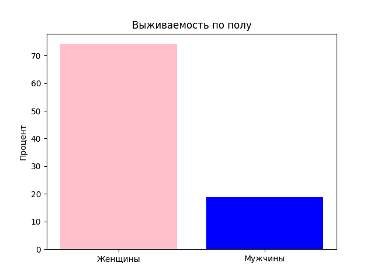

# Анализ выживаемости на Титанике

Учебный проект для стажировки в команде аудита Сбера.  
Цель: выявить закономерности выживаемости пассажиров через анализ пола, класса каюты и возраста.

# Использованные инструменты
- Python 3.13
- pandas (анализ данных)
- matplotlib (визуализация)

# Результаты
- Женщины выживали в **74.2%** случаев против **18.9%** у мужчин
- Пассажиры 1-го класса имели **62.9%** выживаемости

> Код проекта написан студентом ДВГУПС (Карачун Е.Д.) для стажировки в Сбере.
